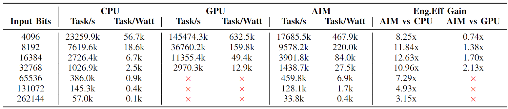

# Team
Principal Investigator: Prof. Peipei Zhou, https://peipeizhou-eecs.github.io/

Ph.D. Students: Zhuoping Yang (Student Lead) and Jinming Zhuang

Faculty Collaborators: Profs. Cunxi Yu (University of Maryland), Alex Jones (Syracuse University)

Student Collaborator: Jiaqi Yin

[PDF](https://peipeizhou-eecs.github.io/publication/2023iccad/2023iccad.pdf)

# AIM: Accelerating **A**rbitrary-precision **I**nteger **M**ultiplication on Heterogeneous Reconfigurable Computing Platform Versal ACAP (ICCAD'23) 

## ACM/IEEE Reference Format
Z. Yang, J. Zhuang, J. Yin, C. Yu, A. K. Jones and P. Zhou, "AIM: Accelerating Arbitrary-Precision Integer Multiplication on Heterogeneous Reconfigurable Computing Platform Versal ACAP," 2023 IEEE/ACM International Conference on Computer Aided Design (ICCAD), San Francisco, CA, USA, 2023, pp. 1-9, [doi: 10.1109/ICCAD57390.2023.10323754](https://doi.org/10.1109/ICCAD57390.2023.10323754).

## Overview
In this repo, we propose AIM architecture and demonstrate the effectiveness of the heterogeneous platform (FPGA + vector units) for arbitrary-precision integer multiplication. The decomposed multiplications are assigned to the AIE array (vector units), which has high computing power, and the carry propagation is offloaded to the programmable logic to take advantage of its traits for fine-grained data processing. 

We carry out experiments on the proposed AIM architecture and compare it with SOTA CPU (Intel Xeon 6346) and GPU (Nvidia A5000). [GMP](https://gmplib.org/) and [CGBN](https://github.com/NVlabs/CGBN) are used for CPU and GPU in the experiments. The results show AIM acheives up to 12.63x and 2.13x energy efficiency gains over CPU and GPU respectively.

We also demonstrate the applicability of AIM architecture on three applications. Please find [LIM](./application/IntegerMultiplication/), [RSA](./application/RSA/), and [Mandelbrot](./application/Mandelbrot/) in this repo.
